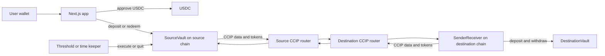
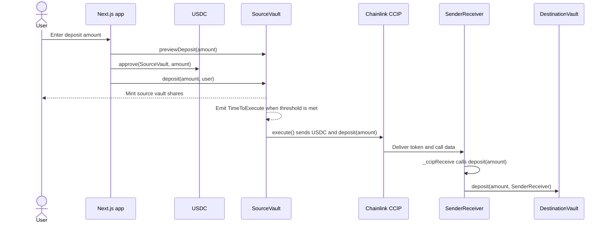
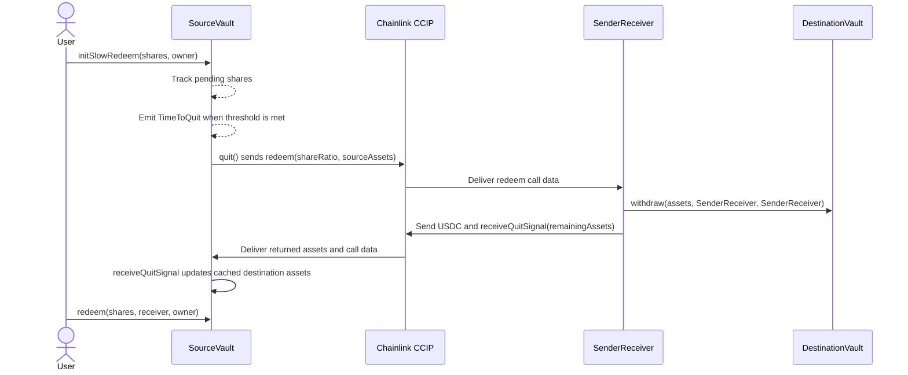
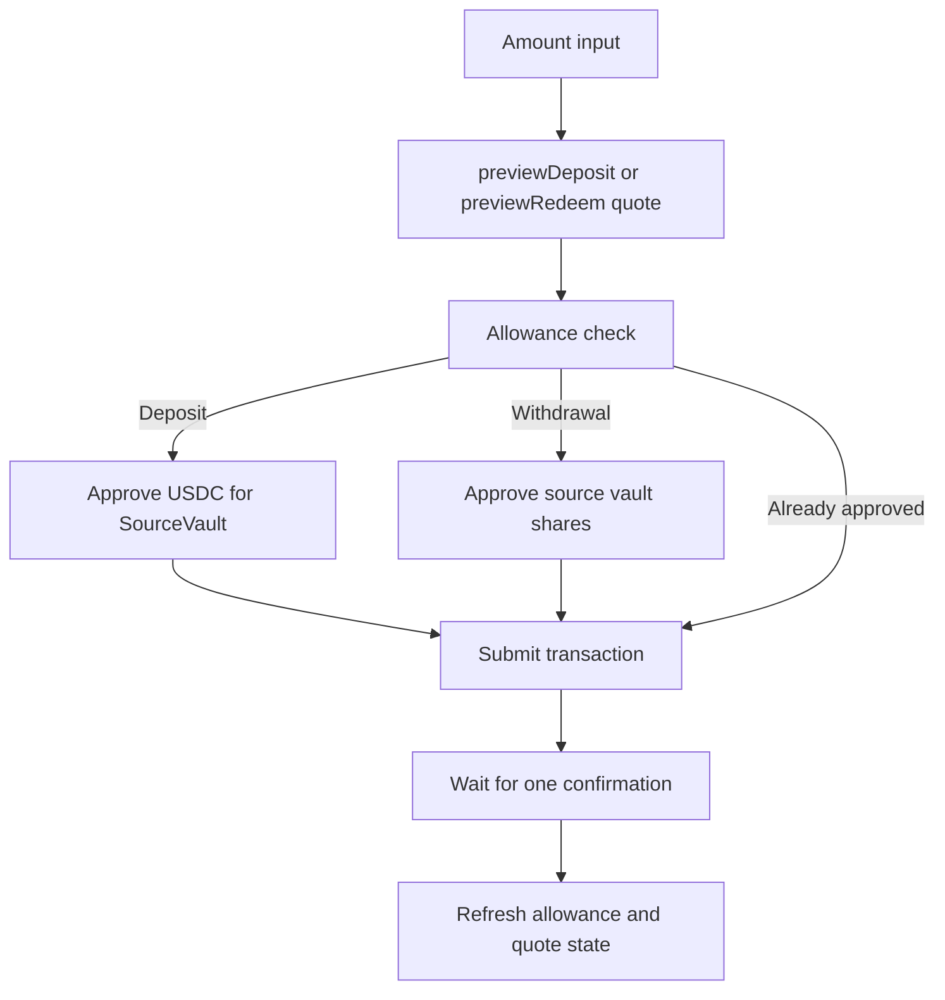

# Raycast Protocol

Raycast Protocol is a cross-chain vault system that lets users deposit USDC on a source chain while the protocol routes pooled liquidity to a destination-chain ERC4626 vault through Chainlink CCIP.

## Repository Map

| Path | Purpose |
| --- | --- |
| `contracts/` | Foundry workspace for Solidity contracts, tests, scripts, and deployment artifacts. |
| `contracts/src/SourceVault.sol` | Source-chain ERC4626 vault that users deposit into and redeem from. |
| `contracts/src/SenderReceiver.sol` | Destination-chain CCIP receiver that deposits into and withdraws from the destination vault. |
| `contracts/src/DestinationVault.sol` | ERC4626-compatible destination vault used by tests and deployment scripts. |
| `contracts/src/ProgrammableTokenTransfers.sol` | Shared Chainlink CCIP send, receive, allowlist, and withdrawal utilities. |
| `contracts/script/` | Foundry deployment scripts. |
| `app/` | Next.js wallet interface for approval, deposit, quote, and withdrawal flows. |
| `app/src/app/config.ts` | Active frontend chain, source vault, and USDC configuration. |

## Protocol Overview

Raycast Protocol separates the user-facing source vault from the productive destination vault:

- `SourceVault` lives on the source chain. Users deposit USDC, receive source vault shares, and redeem shares through the ERC4626 interface.
- `SenderReceiver` lives on the destination chain. It receives CCIP messages, deposits assets into `DestinationVault`, and sends redeemed assets back to `SourceVault`.
- `DestinationVault` is the destination-side ERC4626 vault.
- `ProgrammableTokenTransfers` contains the shared Chainlink CCIP messaging, allowlist, LINK fee, and token-transfer logic used by both cross-chain contracts.

## Contract Topology



## Deposit Flow



## Withdrawal Flow



## Frontend Transaction Flow



## Deployments

Raycast Protocol is Arbitrum-first. Deploy the Arbitrum Sepolia source vault before any Base path.

Recorded Arbitrum Sepolia deployment:

| Contract | Address | Deployment tx |
| --- | --- | --- |
| `SourceVault` on Arbitrum Sepolia | `0x540dd6496ff29780458da1bab487c62f473525bf` | `0x81319a82d5a9019261527df31fbf99e7dee4df7a81bb49b682dde5bb0a33d092` |
| `DestinationVault` on Ethereum Sepolia | `0x8d089e5cf981c8c36981ba1140cc9fe68180d8b7` | `0xe2dc4a548e13768e59832659c05b00fea12fd15121f8caca27be4b1c72419d6b` |
| `SenderReceiver` on Ethereum Sepolia | `0x833d1bbf1e30894cb20bf228485a43a22fcc3e2d` | `0x243205775598daa6a53fac587d7a3b4e39715f2f0a732d48192da711f2cd5fa5` |

Recorded Arbitrum wiring:

| Action | Transaction tx |
| --- | --- |
| Allowlist Ethereum Sepolia receiver on Arbitrum `SourceVault` | `0x0286483613343f27c5bce2851e826432a1554895935a44229058a1fb277636fc` |
| Set `SourceVault` destination receiver | `0x6f27a6ff7057d4e600fb1527b156767d668804626ae2bb0f289fffe5a72c3589` |
| Set `SenderReceiver` destination vault | `0x17c6f46c914be08f4e546cb885703603b9db917139ca3fa545ff093d2c3e07a6` |

| Script path | Network intent | Deploys |
| --- | --- | --- |
| `contracts/script/DeploySvToArbSepolia.s.sol` | Arbitrum Sepolia source chain | `SourceVault` |
| `contracts/script/DeploySrToEthSepolia.s.sol` | Ethereum Sepolia destination chain | `SenderReceiver` |
| `contracts/script/DeploySVToBaseSepolia.s.sol` | Base Sepolia source chain | `SourceVault` |
| `contracts/script/DeploySrToBaseSepolia.s.sol` | Base Sepolia destination chain | `DestinationVault`, `SenderReceiver` |
| `contracts/script/DeploySvToBase.s.sol` | Base mainnet source chain | `SourceVault` |
| `contracts/script/DeploySrToArbitrum.s.sol` | Arbitrum One destination chain | `SenderReceiver` |

Deployment requires a funded deployer key and RPC URLs for the target chains. Set them in your shell or pass them directly to `forge script`.

```bash
cd contracts
forge build
forge test
```

Example broadcast command:

```bash
forge script script/DeploySvToArbSepolia.s.sol:DeploySvToArb \
  --rpc-url "$ARBITRUM_SEPOLIA_RPC_URL" \
  --private-key "$PRIVATE_KEY" \
  --broadcast
```

## Local Development

Install and build the contracts:

```bash
cd contracts
npm install
forge build
forge test
```

Run the app:

```bash
cd app
npm install
npm run dev
```

The app starts on [http://localhost:3001](http://localhost:3001).

## Reference Notes

- External diagram PNG assets are not checked into this repository. The current flow diagrams are embedded above as Mermaid diagrams.
- The frontend points at `app/src/app/config.ts`, which currently selects the Arbitrum Sepolia source vault and Arbitrum Sepolia USDC constants from `app/src/app/constants.ts`.
- Deployment commands run from the `contracts/` directory, so script paths in `forge script` commands are relative to that directory.

## Known Caveats

- `contracts/src/SourceVault.sol` contains an unimplemented `initSlowWithdraw` function. Use `initSlowRedeem` for the queued withdrawal path currently represented in the contracts.
- `quit()` reaches `_sendData(...)`, which is guarded by `onlyOwner`; non-owner automation callers cannot complete the cross-chain redeem path without an ownership or access-control change.
- Pending deposits and withdrawals can race if `execute` and `quit` are processed at the same time.
- The protocol needs a locking or batching mechanism around cross-chain accounting updates.
- Large deposits followed by immediate slow-redeem requests can force extra destination-chain work and gas usage.
- Destination-side exchange-rate movement can create timing-sensitive arbitrage unless deposits and withdrawals are gated around settlement.
